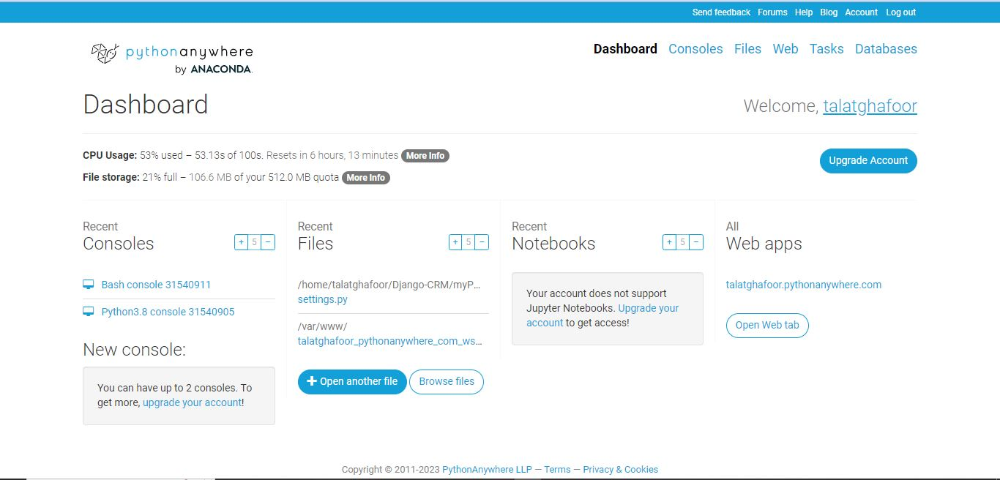
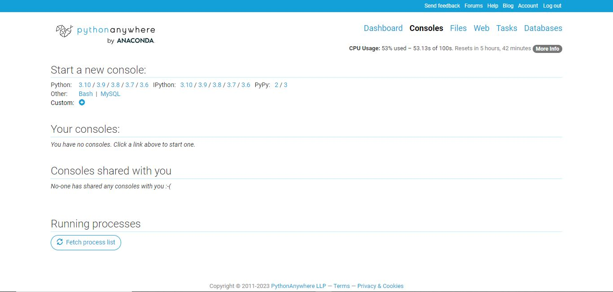
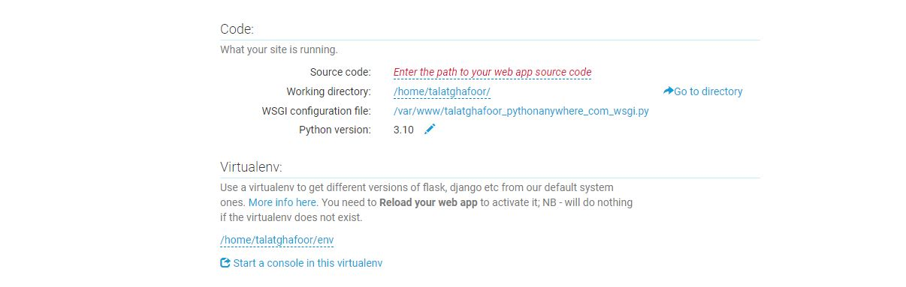
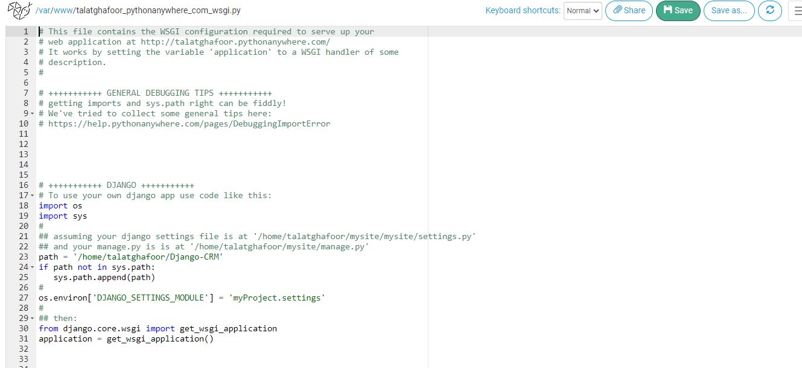

# Django CRM Project

Welcome to the Django CRM project! This is a simple Customer Relationship Management (CRM) system built using Django. The project includes authentication features (login, register, and logout) and CRUD operations for managing employee records.

## Live Demo

Check out the live demo of the project deployed on [Django CRM](http://talatghafoor.pythonanywhere.com/).

## Features

- User Authentication: Register, Login, Logout
- Employee Management: Add, Delete, View, Edit
- Responsive Design
- Deployed on PythonAnywhere

## Getting Started

### Prerequisites

Make sure you have the following installed on your machine:

- Python (3.x recommended)
- Django

### Installation

1. Clone the repository:

   ```bash
   git clone https://github.com/talatghafoor/Django-CRM.git

   cd Django-CRM

   pip install -r requirements.txt

   python manage.py migrate

   python manage.py createsuperuser

   python manage.py runserver

## Deployment

This project is deployed on PythonAnywhere. You can deploy using the following Django deployment guidelines.

1. Create Free Account on [PythonAnyWhere](https://www.pythonanywhere.com/).
2. After Login Dashboard Apears 


3. From Navbar Click on Consoles 


4. Open Bash Console and do following commands:
      ```bash
      git clone https://github.com/talatghafoor/Django-CRM.git

      cd Django-CRM
      python -m venv env

      source myvenv/bin/activate

      pip install -r requirements.txt

My Project Directory Like that:


5. Configure Your Django Settings:

    - Update your Django settings for production. In your settings.py file:
    - Set DEBUG = False
    - Add your PythonAnywhere domain to ALLOWED_HOSTS, e.g., ALLOWED_HOSTS = ['talatghafoor.pythonanywhere.com']

6. Configure Web App on PythonAnywhere:

    - Go to the "Web" tab on PythonAnywhere.
    - Click on "Add a new web app."
    - Choose "Manual Configuration" and select your Python version.
    - Set the "Source code" to the path of your Django project.
    - Set the "Working directory" to the path of your Django project.
    - In the "Virtualenv" section, enter the path to your virtual environment (e.g., /home/your-username/path/to/your/virtualenv).
    - Save the configuration.




7. Update WSGI Configuration:
    ```python
    import os
    import sys

    path = '/home/talatghafoor/Django-CRM'
    if path not in sys.path:
    sys.path.append(path)


    os.environ['DJANGO_SETTINGS_MODULE'] = 'myProject.settings'


    from django.core.wsgi import get_wsgi_application
    application = get_wsgi_application()




8. Reload Your Web App:

- Go back to the "Web" tab and click the "Reload" button for your web app.


9. Open Your Web App:

    - Visit your PythonAnywhere domain (e.g. [Django CRM](http://talatghafoor.pythonanywhere.com/).) in your browser and check if your Django app is running.

   
